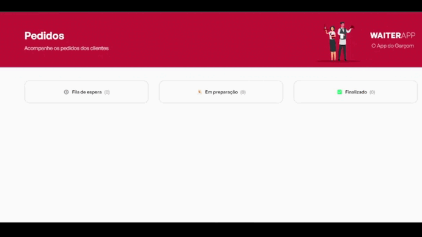

<h1 align="center">
    WAITER APP 🧑‍🍳🍔
</h1>
<h3 align="center"> 
  🚧  Finalizado  🚧
</h3>

<p align="center">
  <a href="#-pré-requisitos">Pré-Requisitos</a>&nbsp;&nbsp;&nbsp;|&nbsp;&nbsp;&nbsp;
  <a href="#-bibliotecas-usadas">Tecnologias</a>&nbsp;&nbsp;&nbsp;|&nbsp;&nbsp;&nbsp;
  <a href="#-project">Read in English</a>
</p>

## 🧑‍💻 Projeto 
  
 Na aplicação MOBILE onde garçons podem cadastrar novas mesas e seus respectivos pedidos, na WEB o gerenciamento desses pedidos podendo modificar seu status.
 
 O projeto foi desenvolvido em React(ViteJS) com TypesScript e ReactNative com expo, banco de dados MongoDB e Styled-Components.
  

 ### ✅ Demonstração Mobile 📲
<p align="center">
    
</p>

### ✅ Demonstração WEB 💻
<p align="center">
    
</p>


### ⚙ Pré-requisitos

Antes de começar, você vai precisar ter instalado em sua máquina as seguintes ferramentas:
[Git](https://git-scm.com), [Node.js](https://nodejs.org/en/),[Expo](https://docs.expo.dev/) e/ou [Yarn](https://yarnpkg.com/), [MongoDB](https://www.mongodb.com/)
Além disto é bom ter um editor para trabalhar com o código como [VSCode](https://code.visualstudio.com/).


### 📗 Rodando a Aplicação

```bash
📗 Installation

# Clone este repositório
$ git clone https://github.com/HugoNunes87/Waiter-APP.git

# Instale as dependências em Server, Mobile e Web
$ yarn ou npm install

# Execute a aplicação SERVER e WEB com
$ yarn dev ou npm run dev

# Execute a aplicação MOBIlE
$ npx expo start


```


## 🚀 Bibliotecas usadas

### Front-end 
* React
* ReactNative
* Expo
* TypesScript
* Styled-Components

### Back-end
*  Node
*  MongoDB

<hr/>

## 🧑‍💻 Project

 In the MOBILE application where waiters can register new tables and their respective requests, in the WEB the management of these requests being able to modify their status.
 The project was developed in React(ViteJS) with TypesScript and ReactNative with expo, MongoDB database and Styled-Components.

<hr/>

Feito Por [Hugo Nunes](https://www.linkedin.com/in/hugo-nunes-323a41164/)
